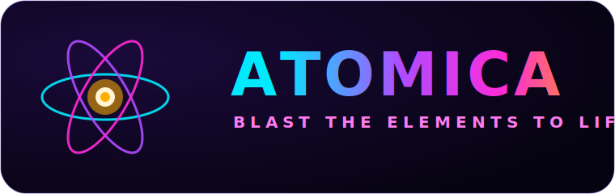
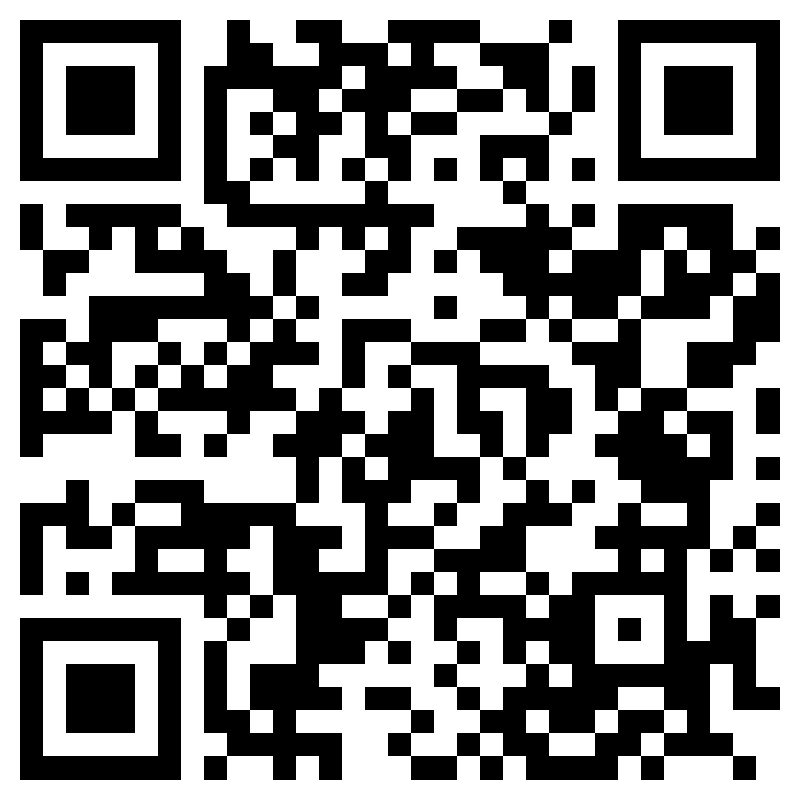

<p align="center">
  
</p>

<h1 align="center">⚛️ Atomica</h1>
<p align="center"><b><i>Blast the elements to life.</i></b></p>

<p align="center">
  <a href="https://neuralsparkai-svg.github.io/neon-elements/"><b>▶ Play Atomica now</b></a>
  &nbsp;•&nbsp; No install needed &nbsp;•&nbsp; Works on phone, tablet &amp; desktop
</p>

<p align="center">
  <b>🟢 Status: Live</b> &nbsp;•&nbsp; Hosted on GitHub Pages &nbsp;•&nbsp; Single-file PWA &nbsp;•&nbsp; Updated June 2026
</p>

<p align="center">
  <br>
  <sub>Scan to play on your phone</sub>
</p>

---

## What is Atomica?

**Atomica** is a fast, glowing, kid-friendly arcade game that secretly teaches you the **periodic table**.

You stand in a neon arena with an energy blaster. Glowing orbs drift toward you — and **every orb carries a real chemical element**: its symbol, its atomic number, and its name. You move, aim, and blast them before they reach you. Each time you destroy one, Atomica **says the element's name out loud** and flashes a **fun fact** about it.

It's the feeling of an arcade survival game, with the periodic table doing the teaching in the background. You're not "studying" — you're *playing* — but by the end of a session you've seen, heard, and reacted to dozens of elements.

> **The core idea:** repetition + reaction + reward. When you have to *recognize* "O — Oxygen" fast enough to shoot it, and you *hear* it spoken the instant you do, the element stops being a flashcard and becomes muscle memory. Then a **quick quiz between waves** turns that recognition into active recall.

---

## ✨ What it does

- 🎮 **Four game modes**, each teaching the table a different way (see below).
- 🔊 **Every element spoken aloud** — hear how "Ytterbium" or "Molybdenum" actually sounds.
- 💡 **Fun facts on every blast** — *"Tungsten: has the highest melting point — it glows in light bulbs!"*
- 🧪 **All 118 elements**, weighted so famous ones (H, O, Fe, Au…) appear most, but every element can show up.
- 📖 **Study Mode** — auto-pauses on each hit so you can actually read the fact, then resume.
- ❓ **Between-wave quizzes** — a quick multiple-choice question after every wave (symbol ↔ name, element groups, fun-fact recall) for bonus points. Toggle on/off.
- 🎚️ **Difficulty** (Easy / Normal / Hard) and **Aim Assist** for younger players.
- 🎵 **Generated neon soundtrack + sound effects** — no audio files, zero load time.
- 🏆 **High scores** saved per mode, and a **"collect all 118"** progress board.
- 📱 **Plays anywhere** — responsive, touch-first, installable to your home screen.

---

## 🧠 How Atomica actually teaches the table

Most "periodic table apps" show you a grid and hope you remember it. Atomica turns each fact into something you **do**, so it sticks. Here's how each mode unlocks a different layer of the table:

| Mode | What you do | What you learn |
|------|-------------|----------------|
| 💡 **Fun Facts** | Blast anything, hear it named, read a fact | **Symbol → name** recognition + real-world meaning (*Na = Sodium = table salt*) |
| 🎯 **Find the Element** | A target is named; hunt it among many | **Recall under pressure** — you learn to spot "the one that says **K**" instantly |
| 🎨 **Element Groups** | Orbs are **colored by family** | **Periodic structure** — you *see* that Li, Na, K share a color, so they share properties (alkali metals) |
| 📚 **Collection Quest** | Light up all 118 on a board | **Completeness + scale** — the table stops being abstract and becomes a map you're filling in |

**Concrete examples of what "clicks":**

- **Symbols that don't match the name** finally stick: after a few rounds you stop being surprised that **Au = Gold**, **Fe = Iron**, **Pb = Lead**, **W = Tungsten** — because you've *shot* them and *heard* them dozens of times.
- **Families become visible:** in Element Groups mode, every noble gas (He, Ne, Ar, Kr…) glows the same color. You internalize "these belong together" without reading a textbook.
- **Atomic number gets intuitive:** the number sits right on each orb, and heavier elements are worth more points — so bigger number = heavier = more valuable becomes a gut feeling.
- **Pronunciation, solved:** you'll never again hesitate on "Phosphorus," "Cesium," or "Praseodymium" — you've heard them spoken in the heat of the game.

---

## 🛣️ Roadmap — more learning, same fun

Atomica is built to grow into a full periodic-table learning playground. Planned additions:

- 🧫 **Compound Crafting** — combine elements mid-game (Na + Cl → salt!) to learn how elements bond.
- ⚡ **Electron shells & configuration** — orbs that reveal an element's electron layout.
- 🌡️ **States of matter** — solid / liquid / gas challenges (only Mercury is a liquid metal — prove it!).
- 📈 **Periodic trends** — boss waves organized by period or group to teach electronegativity & reactivity.
- 👩‍🏫 **Teacher / classroom mode** — pick a set of elements to focus a lesson, with a simple progress view.
- 🌍 **More languages** for spoken names and facts.

> Want a feature prioritized for your classroom or kid? Open an issue — this is built to be useful, not just flashy.

---

## 🚀 Setup & install

### Option A — Just play (everyone)
**You don't need to install anything.** Open the link in any modern browser:

👉 **https://neuralsparkai-svg.github.io/neon-elements/**

…or scan the QR code above with your phone camera.

### Option B — Add it to your home screen (plays full-screen, like an app)
- **iPhone / iPad (Safari):** open the link → tap **Share** → **Add to Home Screen** → **Add**. Launch it from the new **Atomica** icon.
- **Android (Chrome):** open the link → tap **⋮** → **Add to Home screen** (or accept the **Install** prompt).

### Option C — Run it yourself / host your own copy (developers)
Atomica is a **single, self-contained HTML file** — no build step, no dependencies, no server required.

```bash
# 1. Clone the repo
git clone https://github.com/neuralsparkai-svg/neon-elements.git
cd neon-elements

# 2. Open it — that's it
#    Windows:
start index.html
#    macOS:
open index.html
#    Linux:
xdg-open index.html
```

Prefer a local server (recommended so the app manifest/icons load exactly like production)?

```bash
# Python 3
python -m http.server 8080
# then visit http://localhost:8080
```

To deploy your own version, drop the folder onto any static host (**GitHub Pages**, **Netlify**, **Cloudflare Pages**, **Vercel**) — it's just static files.

---

## 🎮 How to play

### On Desktop
| Control | Action |
|--------|--------|
| **W A S D** | Move |
| **Mouse** | Aim |
| **Left click (hold)** | Shoot |
| **P** or **Esc** | Pause / resume |

### On Mobile / Tablet (touch)
- **Left thumb** — drag to move (a joystick appears under your finger).
- **Right thumb** — touch/hold to aim and fire (with optional **Aim Assist** snapping to nearby orbs).
- **⏸ / 🔊 / ⛶** buttons (top-right) — pause, mute, and fullscreen.

**Goal:** survive the waves, blast as many elements as you can, and learn the whole table. You start with 3 health bars; an orb that touches you costs one. Last as long as possible and beat your high score!

---

## 🎨 Logo & brand

**Name:** Atomica &nbsp;|&nbsp; **Tagline:** *Blast the elements to life.*

The mark is a glowing **“A” inside an electron orbit** — the wordmark’s atom and the game’s energy-orb arena in one symbol. The animated `logo.svg` brings it to life: electrons orbit a pulsing nucleus while the wordmark glows through the game’s neon palette (cyan → purple → pink → orange).

| Asset | File |
|------|------|
| Animated logo | [`logo.svg`](logo.svg) |
| App icon (512) | [`icon-512.png`](icon-512.png) |
| App icon (192) | [`icon-192.png`](icon-192.png) |
| Apple touch icon | [`apple-touch-icon.png`](apple-touch-icon.png) |
| Play QR code | [`qr.png`](qr.png) |

**Palette:** background `#05030f` · cyan `#00eaff` · purple `#b14bff` · pink `#ff2bd6` · orange `#ffae00`

---

## 🧩 Tech notes

- **One file, zero dependencies** — HTML5 Canvas, Web Audio (procedural music + SFX), Web Speech (spoken names), and `localStorage` (scores/settings).
- **Crisp everywhere** — renders at device pixel ratio; scales objects to screen size.
- **Installable PWA** — web-app manifest + icons for home-screen, full-screen launch.
- **Non-violent & kid-safe** — the only "enemies" are glowing energy orbs carrying elements.

---

<p align="center"><sub>Made with ⚡ and a love for the periodic table. Atomica — blast the elements to life.</sub></p>
